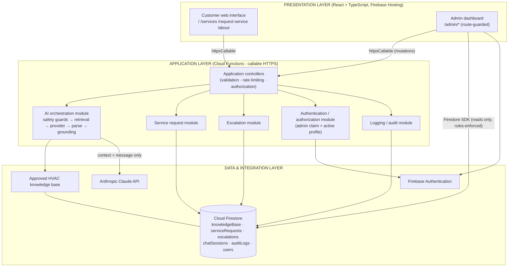
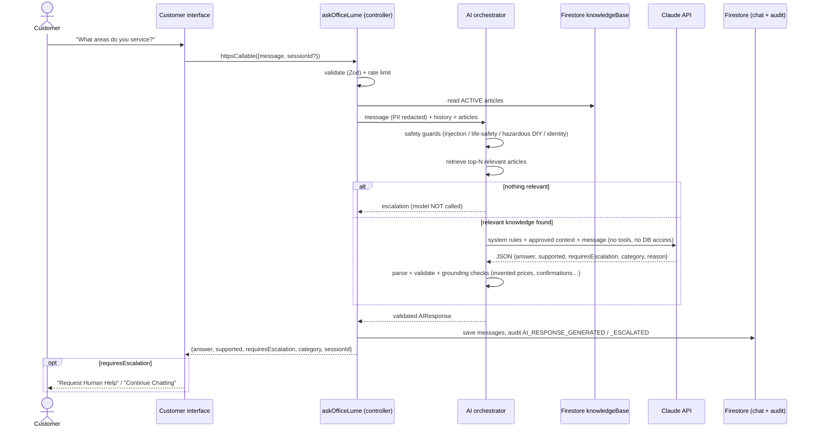
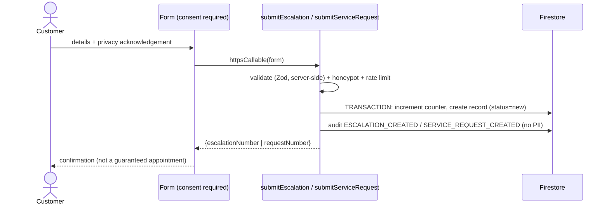

# OfficeLume Architecture

OfficeLume is a layered, modular application. The browser never talks to the AI provider and never writes to Firestore; every business operation passes through a small set of **controlled Cloud Functions**.

## 1. Layers



| Layer | Responsibilities | Code |
|---|---|---|
| **Presentation** | Pages, forms, chat UI, admin tables. Client-side validation for instant feedback and route guarding for UX. **Not** a security boundary. | `src/pages`, `src/components`, `src/features/*`, `src/layouts` |
| **Application** | The only place business rules run: input validation (Zod), rate limiting, role checks, reference-number allocation, status-transition rules, AI orchestration, audit logging. | `functions/src/*` |
| **Data & integration** | Firestore collections, Firebase Auth, the approved knowledge base, and the external Claude API. Access from the browser is limited by `firestore.rules`. | `firestore.rules`, `functions/src/ai/claudeProvider.ts` |

### Service abstractions (NFR-06 / NFR-07)

* Browser: `src/services/*` is the only code that touches Firebase (`firebase/config.ts` initialises it once). Components call service functions and never import Firebase directly.
* Server: `AIProvider` interface (`functions/src/ai/types.ts`) with `ClaudeProvider` and `MockProvider`; `providerFactory` picks one. Swapping vendors means adding one class.

## 2. Data flows

### 2.1 Customer question (grounded answer or escalation)



Failure paths all end in a friendly message plus human escalation: provider timeout/API error/refusal, unparseable output, output that fails grounding, empty knowledge base.

### 2.2 Human escalation and service request



The escalation *reason* is read server-side from the chat session (what the AI actually decided), never from the browser.

### 2.3 Administrator

```mermaid
sequenceDiagram
  actor Adm as Administrator
  participant UI as /admin/login
  participant FA as Firebase Authentication
  participant Fn as recordAdminLoginEvent
  participant R as Firestore rules
  participant U as updateServiceRequestAdmin
  participant DB as Firestore

  Adm->>UI: email + password
  UI->>FA: signInWithEmailAndPassword
  FA-->>UI: ID token (custom claim role=admin)
  UI->>Fn: recordAdminLoginEvent(success)
  Fn->>DB: verify claim + active users/{uid}; audit ADMIN_LOGIN_SUCCESS/FAILURE
  Fn-->>UI: {authorized}
  Note over UI: non-admins are signed straight back out
  UI->>R: read serviceRequests (dashboard)
  R->>DB: isAdmin()? claim AND active profile
  DB-->>UI: documents
  Adm->>UI: change status / add note
  UI->>U: httpsCallable({requestId, status, note})
  U->>U: requireAdmin, validate, check transition
  U->>DB: TRANSACTION: update record + status history + audit
```

## 3. Security boundaries

| Concern | Enforcement |
|---|---|
| Claude API key | Firebase Secret Manager (`ANTHROPIC_API_KEY`), bound only to `askOfficeLume`. Never in Vite variables or the browser bundle. |
| AI cannot mutate anything | Provider gets text only; no tools. All writes are done by controller code after the response is validated. |
| Client writes | **None.** `firestore.rules` denies every client write; all mutations are callable functions. |
| Admin identity | `role: "admin"` custom claim (set only by Admin SDK script) **and** active `users/{uid}` profile. Checked in rules and in `requireAdmin`. |
| Instant revocation | Set `users/{uid}.active=false` (or run the script with `--revoke`); no waiting for token expiry. |
| Abuse | Per-caller (hashed IP) Firestore rate limits, honeypot fields, input length limits, markup rejection. |
| Data minimisation | Chat logs and text sent to Claude have emails/phone numbers redacted; audit metadata is allow-listed and contains no contact details. |

See [SECURITY.md](./SECURITY.md) for the rules strategy in detail.

## 4. Firestore data model

| Collection | Written by | Readable by | Notes |
|---|---|---|---|
| `users/{uid}` | admin script | the user themself | `{displayName, email, role, active, createdAt, updatedAt}` - no passwords |
| `knowledgeBase/{id}` | `saveKnowledgeArticleAdmin` | admins | `{title, category, content, active, ...}`; only `active` articles feed the AI |
| `serviceRequests/{id}` | `submitServiceRequest`, `updateServiceRequestAdmin` | admins | `requestNumber` `SR-YYYY-NNNNNN`, status, `statusHistory[]`, `adminNotes[]` |
| `escalations/{id}` | `submitEscalation`, `updateEscalationAdmin` | admins | `escalationNumber` `ESC-YYYY-NNNNNN`, reason, status, notes |
| `chatSessions/{id}/messages/{id}` | `askOfficeLume` | admins | role, content (PII redacted), supported, requiresEscalation, category |
| `auditLogs/{id}` | all functions | admins | `{eventType, actorType, actorId, targetType, targetId, action, metadata, timestamp}` |
| `counters/*`, `rateLimits/*` | functions | nobody | server-internal |

Reference numbers are allocated inside the same Firestore transaction that creates the record, so they are unique and gap-free.

## 5. Callable function catalogue

| Function | Caller | Purpose |
|---|---|---|
| `askOfficeLume` | public | AI receptionist answer |
| `submitServiceRequest` | public | create service request |
| `submitEscalation` | public | create human-help request |
| `recordAdminLoginEvent` | public (failure) / admin (success) | audit sign-in outcome, confirm admin status |
| `updateServiceRequestAdmin` | admin | status transition and notes |
| `updateEscalationAdmin` | admin | status transition and notes |
| `saveKnowledgeArticleAdmin` | admin | create / update / deactivate knowledge |
